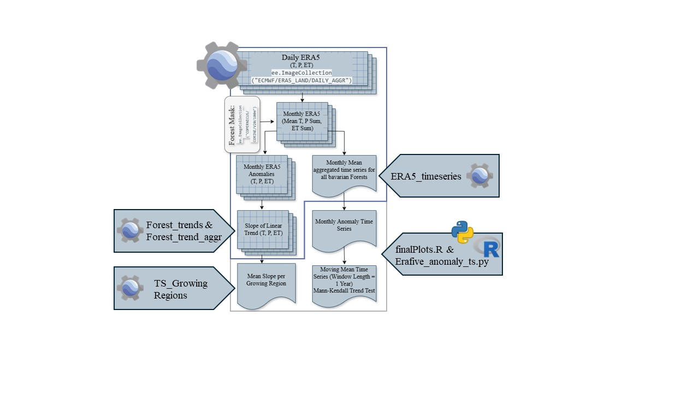

<!-- README.md is generated from README.Rmd. Please edit that file -->

# HotForests

<!-- badges: start -->
<!-- badges: end -->

`HotForests` is a CloudComputing Project supervised by Dr. Maninder
Dhillon at the University of Würzburg. The goal of `HotForests` is to
detect hotspots in Bavarian Forest using the ERA5 climate reanalysis
data from 1950 until 2024. The climate variables “temperature_2m”,
“total_evaporation_sum” and “total_precipitation_sum” were analysed by
calculating the slope of the linear trend over the monthly anomalies of
the climate parameters.

The following workflow was utilised to that end:

The Google Earth Engine Scripts are available via the following Link:
